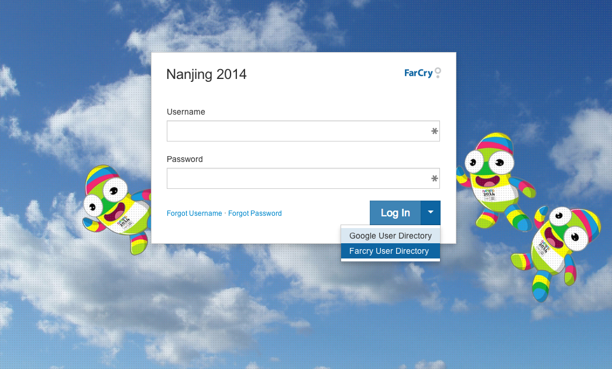
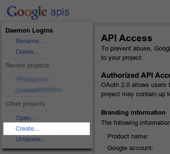
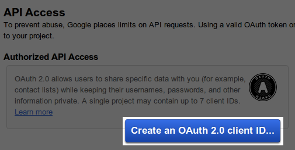
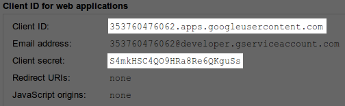

# Google OAuth User Directory Plugin

## Overview

Google UD provides federated logins for FarCry publishing platform using [OAuth 2.0 for Google accounts](https://developers.google.com/accounts/docs/OAuth2Login). You can set up Google authentication as an option in the login, or the default login for immediate access to the webtop.



## Installation

### Part 1: Google Configuration

Create a Google Account and login to the [Google API Console](https://code.google.com/apis/console/).

Create a new project



In API Access, create a client ID



You will need to add the links FarCry will be using to this config:

- redirect uri: `http://[your domain here]/index.cfm?type=gudLogin&view=displayLogin`
- javascript origin: `http://[your domain here]`

You will need the Client ID and Client Secret - either copy them, or keep the window open




### Part 2: FarCry Configuration

Download and add the googleud plugin to your project:

<https://github.com/farcrycore/plugin-googleud>

Your plugin will typically be stored in `./farcry/plugins/googleud` and you can register it within your project by adding it to the `./www/farcryconstructor.cfm`. For example:

```
<cfset THIS.plugins = "googleud,googleanalytics" /> 
```

Update the application (ie restart the application) to register the newly added plugin.

Configure the plugin:

- Add the **Google Client ID** and **Client Secret** into the Google User Directory configuration under `ADMIN > Configuration`.
- Deploy the new content types - **gudUser** and **gudGroup** through the webtop `ADMIN > Developer Tools > COAPI`. 
- Create a Google user group (Admin -> General Admin -> User Directory -> Group Groups) for your specific email domain (anyone logging in with an email within this domain will be automatically assigned to this group)
- Add your Group to the appropriate FarCry roles (Admin -> General Admin -> Roles & Permissions -> Roles)

## But wait, there's more!

Often you will have an existing account in the application you have added GoogleUD to. 

This can lead to issues with:
- history tracking
- content ownership
- the old account won't be disabled if the Google account is

In the Webtop there is a utility for merging an existing account into your Google login account.

